<p align="center">
  <picture>
    <source media="(prefers-color-scheme: dark)" srcset="assets/logo-horizontal-dark.svg">
    
  </picture>
</p>

# svganim

Turn a matplotlib figure and a per-frame update function into one
self-contained, looping, animated SVG.



- Vector output: sharp at any size
- No JavaScript: works in an `` tag, in GitHub READMEs and in most docs
- Only what changes is animated: static parts (axes, data) cost nothing
- Reproducible output: same input, same bytes
- Dependencies: matplotlib only

## Usage

```python
import matplotlib.pyplot as plt
import numpy as np
from svganim import anim_to_svg

fig, ax = plt.subplots()
x = np.linspace(0, 2 * np.pi, 200)
(line,) = ax.plot(x, np.sin(x))


def update(i):
    line.set_ydata(np.sin(x + i / 10))


anim_to_svg(fig, update, n_frames=60, fps=20, hold=1.0, path="wave.svg")
```

```html

```

See [examples/](examples/) for a runnable script and an HTML page that embeds
the result with ``.

### `anim_to_svg(fig, update, n_frames, fps=20, hold=1.0, path=None, *, precision=3)`

| Argument    | Description                                                    |
| ----------- | -------------------------------------------------------------- |
| `fig`       | The matplotlib figure to render.                               |
| `update`    | Called as `update(i)` before frame `i` is rendered.            |
| `n_frames`  | Number of frames.                                              |
| `fps`       | Frames per second.                                             |
| `hold`      | Seconds to hold the last frame before looping.                 |
| `path`      | If given, the SVG is also written to this file.                |
| `precision` | Decimals kept in coordinates. Lower means smaller files.       |

Returns the SVG as a string.

## How it works

Every frame is rendered to SVG and the first one becomes the base document.
The frames are then compared element by element. Wherever an attribute or an
inline style property changes (`d`, `x`, `y`, `fill`, `transform`, ...), an
`<animate>` child with one value per change is added. Elements that never
change are left untouched.

## Limitations

- The number and order of SVG elements must be identical in every frame, for
  example the same number of lines and markers. Otherwise it raises
  `ValueError`. Path vertex counts may change.
- Text is rendered as glyphs and cannot be animated.
- Vector only: raster images (`imshow`, `rasterized=True`) are rejected with
  `ValueError`. Use `pcolormesh` for grids.
- Transforms must be a single `translate`, `scale`, `rotate` or `skew`.
- File size grows linearly with the number of frames and the number of
  animated elements.
- Animation uses SMIL, which all current browsers support.

## License

MIT

## Development

```bash
uv run pytest                                   # tests
uv run sphinx-build -W docs docs/_build/html    # build the docs
uv run sphinx-autobuild docs docs/_build/html   # live-reloading docs
```

The API reference comes from the docstrings and the example animations are
regenerated from `examples/` on every docs build.
